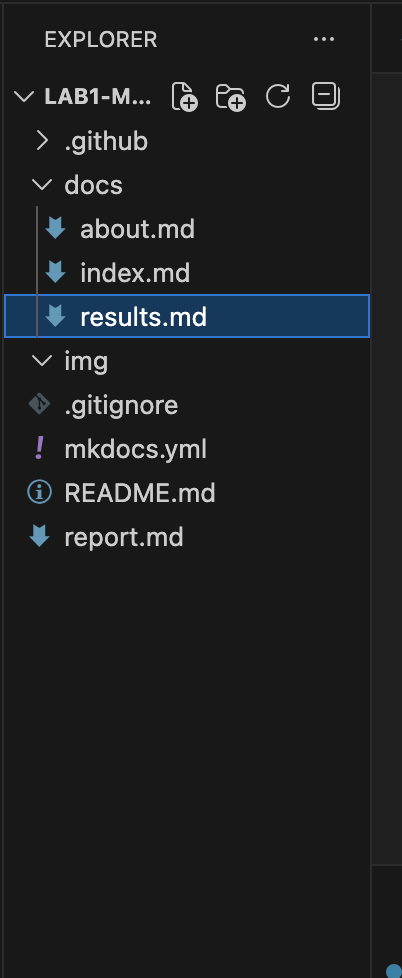

1. Создание шаблона проекта с помощью mkdocs
2. Создание трех страниц: index, about, results

3. Деплой на gitHub Pages

1. Отечественные CDN — позволяют ускорить загрузку сайта для пользователей в России и СНГ, уменьшают задержки и нагрузку на сервер; примеры: Яндекс CDN, Selectel CDN, Rostelecom CDN.

2. Gitverse для CI/CD — помогает автоматизировать сборку, тестирование и деплой сайта при каждом обновлении кода; поддерживает пайплайны, интеграции с GitHub/GitLab.

3. Варианты деплоя статического сайта:

- GitHub Pages — простой деплой прямо из репозитория;

- CDN + Object Storage (например, S3, Яндекс Облако) — для быстрого распространения;

- Docker + VPS — если нужен контроль над окружением;
Технические инструменты: Git, GitHub Actions/Gitverse, MkDocs/Hexo/Jekyll для генерации сайта, команды для сборки (mkdocs build) и деплоя.
