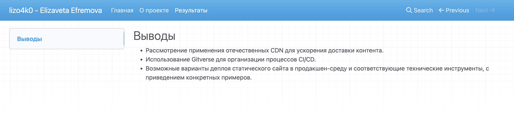
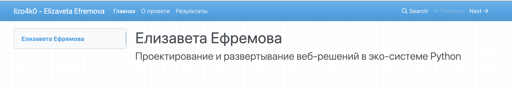

1. Создание шаблона проекта с помощью mkdocs
2. Создание трех страниц: index, about, results

3. Наполнение статического сайта информацией о лабораторной работе

4. Деплой созданного сайта на gh-pages

1. Отечественные CDN позволяют кэшировать и раздавать контент с ближайших к пользователю серверов, тем самым уменьшают задержку и нагрузку на основной сервер.
Возможности: кеширование статики, HTTPS, защита от DDoS, балансировка нагрузки.

2. Возможности Gitverse для CI/CD:
- запуск пайплайнов (сборка, тесты, деплой)
- интеграция с Docker
- автодеплой при push в ветку
- контроль версий и code review

3. Варианты деплоя статического сайта
- GitHub Pages, Gitverse Pages, Yandex Object Storage + CDN
- Облачные платформы: Vercel, Netlify
- Собственный сервер: Nginx/Apache + VPS
